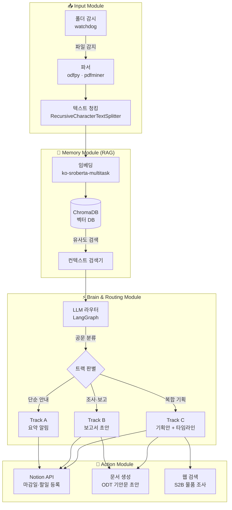

# school-agent

> 초등학교 교사의 행정 업무를 자동화하는 AI 에이전트 시스템

---

## 전체 시스템 아키텍처



---

## 기술 스택

| 레이어 | 기술 | 이유 |
|--------|------|------|
| **파일 감시** | `watchdog` | 폴더 변화 실시간 감지 |
| **ODT 파싱** | `odfpy` | 한국 공문 주 형식 |
| **PDF 파싱** | `pdfminer.six` | 스캔 공문 대응 |
| **임베딩** | `ko-sroberta-multitask` | 로컬 한국어 모델, API 비용 없음 |
| **벡터 DB** | `ChromaDB` | 로컬 영구 저장, 쉬운 검색 |
| **에이전트 프레임워크** | `LangGraph` | Track A/B/C 상태 기계 라우팅 |
| **오케스트레이션** | `LangChain` | 툴 연결, 프롬프트 관리 |
| **LLM** | Claude 3.5 Sonnet | 한국어 공문 이해도 |
| **Notion 연동** | Notion API | 마감일·할일 자동 등록 |
| **UI** | Streamlit | 비개발자도 쉽게 사용 |

---

## 구현 로드맵

| Phase | 기간 | 내용 | 상태 |
|-------|------|------|------|
| **Phase 1** | 1~2주 | 문서 인덱싱 (ODT 파싱 + ChromaDB + 검색) | 🔨 진행 중 |
| **Phase 2** | 3~4주 | LLM 라우터 + Track A 요약 알림 | 📋 계획 |
| **Phase 3** | 5~6주 | Track B 보고서 초안 + Notion 연동 | 📋 계획 |
| **Phase 4** | 7~10주 | Track C 기획안 + ODT 생성 + S2B 검색 | 📋 계획 |

---

## 폴더 구조

```
school-agent/
├── README.md                  ← 이 파일 (전체 아키텍처)
└── skills/
    └── doc-indexer/           ← Phase 1: 문서 인덱싱 스킬
        ├── SKILL.md
        └── scripts/
            ├── indexer.py     ← 폴더 감시 + 파싱 + 벡터 저장
            ├── search.py      ← 자연어 검색 테스트
            ├── requirements.txt
            └── .env.example
```

---

## 빠른 시작 (Phase 1)

```bash
cd skills/doc-indexer/scripts
pip install -r requirements.txt
cp .env.example .env
# .env 에서 WATCH_FOLDER 경로 설정 후:

python indexer.py --once     # 기존 파일 전체 인덱싱
python indexer.py            # 폴더 실시간 감시 모드
python search.py "과학의 달 예산"  # 검색 테스트
```

---

## 현재 스킬 목록

| 스킬 | 설명 | Phase |
|------|------|-------|
| [`doc-indexer`](./skills/doc-indexer/SKILL.md) | ODT/PDF 파싱 + ChromaDB 인덱싱 + 검색 | 1 |
| `doc-router` | LLM 기반 Track A/B/C 분류 | 2 (예정) |
| `notion-sync` | 마감일·할일 Notion 자동 등록 | 3 (예정) |
| `draft-writer` | 기안문 ODT 초안 생성 | 4 (예정) |
